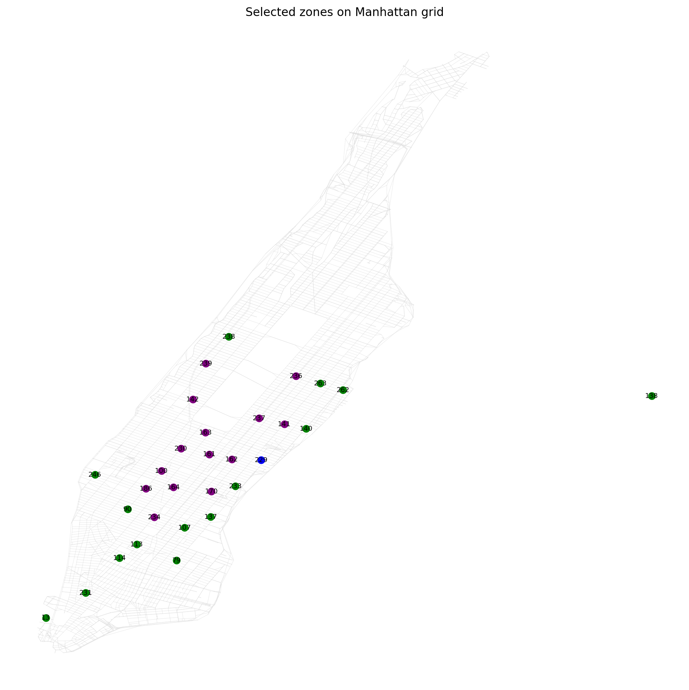
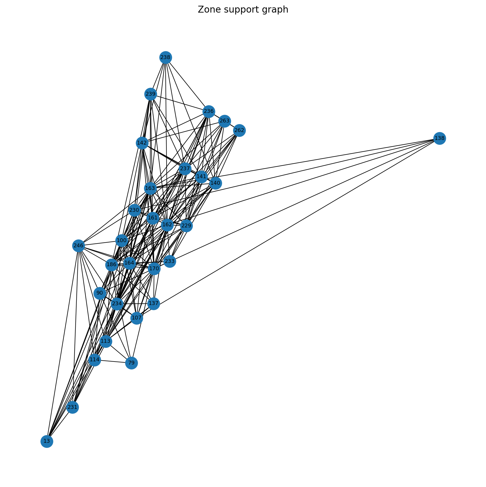
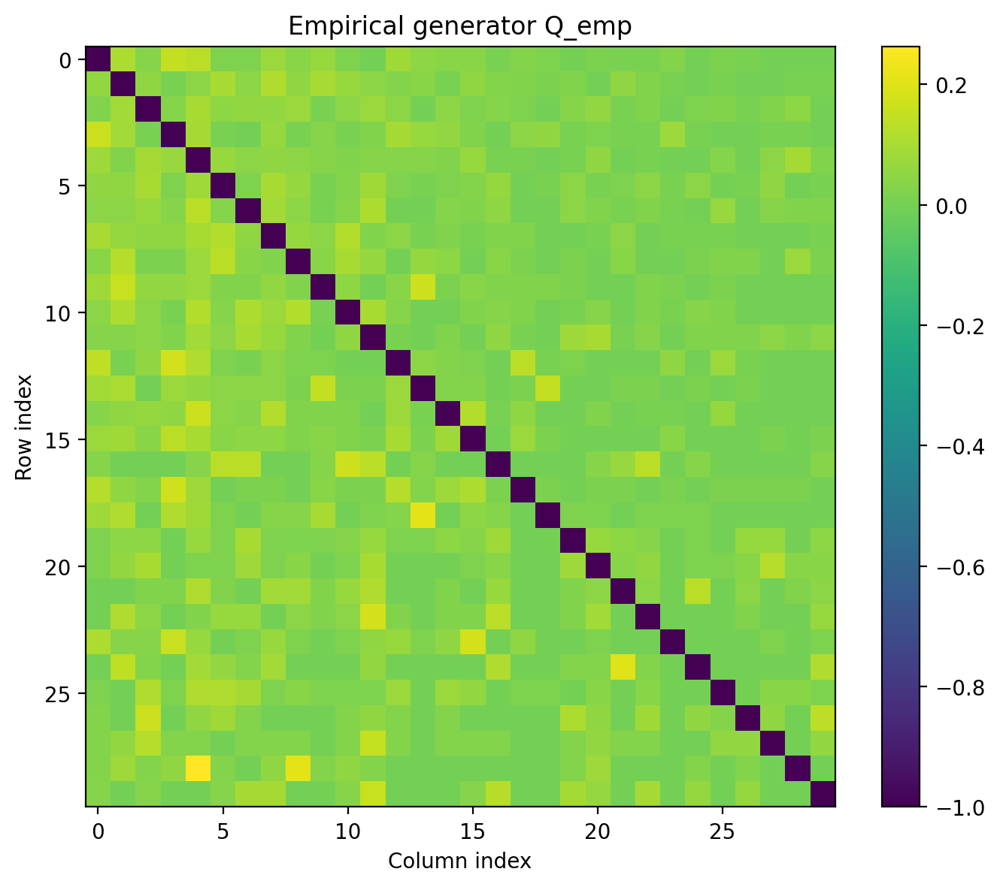
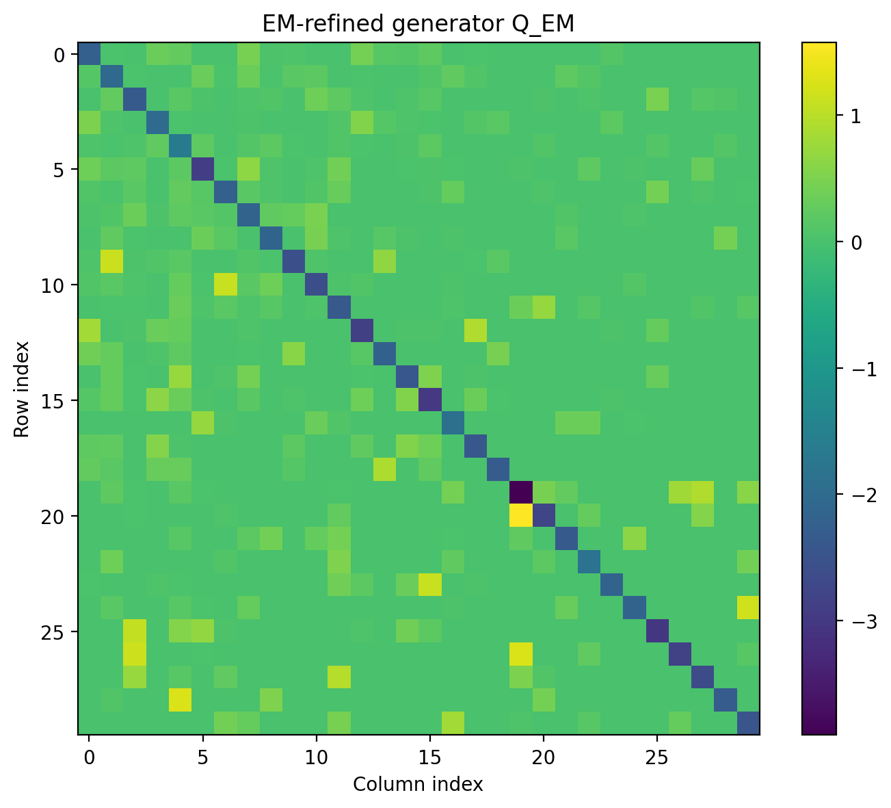
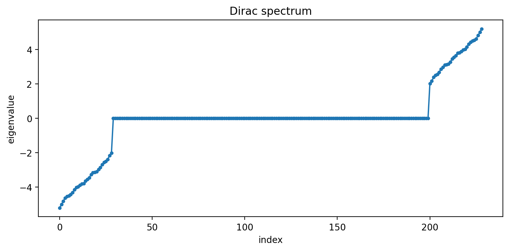
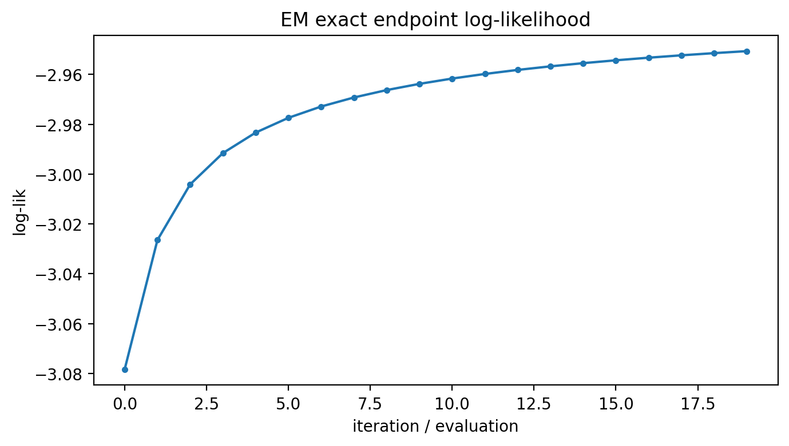

# Yellow cab dynamics: a generator for NYC taxi movement

This is the hardest application in my research, and the one I find most fun. I learn a
continuous-time Markov chain (CTMC) generator for taxi movement across 30 Manhattan
zones directly from NYC yellow cab trip records, in the censored setting where I only
see zone to zone endpoints and the true generator is unknown. The whole point is to
show that the same Dirac machinery I validate on synthetic and analytic benchmarks
carries over to noisy, real mobility data at scale.

This study, together with the predator-prey model, feeds into a paper I am preparing,
"Inferring hidden trajectories in endpoint-only Markov jump processes: regularized
likelihood with applications to the NYC yellow taxi graph and predator-prey model."

## Pipeline

1. Zone graph from trip data. From `yellow_tripdata_2016-01.csv` I select the busiest
   zones (here the 30 most active TLC zones), and observed pickups and drop-offs
   define an undirected zone transition graph with 199 edges.

2. Graph Dirac operator. The signed incidence matrix B gives the bipartite Dirac
   operator D = [[0, B^T], [B, 0]], whose eigenvectors form the Fourier basis on the
   augmented zone-and-edge space. No Laplacian is used.

3. Three generators, compared.
   - Q_emp, the empirical generator from raw transition counts.
   - Q0, a generator from a constrained Dirac-spectral objective.
   - Q_em, an EM-refined generator over bridge sub-intervals.

4. Bridge refinement and error analysis. I reconstruct backward Schrodinger
   potentials and Doob h-transform bridges from each generator, then use iterative
   reference-layout refinement and a pointwise bell-curve error analysis to see how
   sharply the learned dynamics reproduce observed zone to zone routes.

5. 3D structure views. Tube stability checks and petal visualizations render the
   bridge geometry and its uncertainty in three dimensions.

## Results

```
Trips loaded                3,944        Zones                     30
Zone-graph edges            199          Endpoint samples          1,000
Horizon                     1.0
Q0 optimization             converged (26 iterations, projected-gradient stop)
EM iterations               20 (monotone log-likelihood improvement)

Exact log-likelihood  Q0    -3.3054
Exact log-likelihood  Q_h   -3.8618
Exact log-likelihood  Q_em  -2.9506   best fit to held-out endpoint transitions
```

EM improves the average endpoint log-likelihood monotonically from -3.078 to -2.951
over 20 iterations while the step norm decays from 3.35 to 0.10. That is the kind of
stable convergence I want on real data, where there is no true generator to compare
against.

## Figures

<table>
  <tr>
    <td><br><sub>The 30 selected NYC zones</sub></td>
    <td><br><sub>Observed zone-transition graph</sub></td>
  </tr>
  <tr>
    <td><br><sub>Empirical generator</sub></td>
    <td><br><sub>EM-refined generator</sub></td>
  </tr>
  <tr>
    <td><br><sub>Dirac spectrum</sub></td>
    <td><br><sub>EM log-likelihood convergence</sub></td>
  </tr>
</table>

All figures are in [`figures/`](figures), the learned generators and Dirac data are in
[`results/`](results), and an example reconstructed route is in `reycd3outputs/`.

## What is in here

```
ycd3_reference_refinement.py     iterative Doob-bridge reference-layout refinement
ycd3_tube_stability_check.py     3D tube stability check
ycd3_petal_visualization.py      petal-style bridge visualization
ycd3_petal_3d.py                 3D petal rendering
yellow_tripdata_2016-01.csv      input trip records (NYC TLC, January 2016 sample)
ycd3outputs/                     generators (CSV), Dirac data, figures, summaries
reycd3outputs/                   refined-layout route outputs
```

## Running it

```bash
pip install numpy pandas scipy matplotlib

# refinement and error analysis over the precomputed generators
python ycd3_reference_refinement.py --a 9 --b 1 --c 13 --T 1.0 --max_k 3 --rho 0.27

# 3D stability and petal views
python ycd3_tube_stability_check.py
python ycd3_petal_3d.py
```

Data comes from the NYC Taxi and Limousine Commission yellow cab trip records (a
January 2016 sample is included). The full dataset is available from the
[NYC TLC trip record page](https://www.nyc.gov/site/tlc/about/tlc-trip-record-data.page).

## Where this fits

One of four repositories built on the same framework: logistic growth (synthetic
validation), predator and prey (real ecology), rotational vector field (analytic
ground truth), and yellow cab dynamics (this repo).

## License

Released under the MIT License. See [LICENSE](LICENSE).
